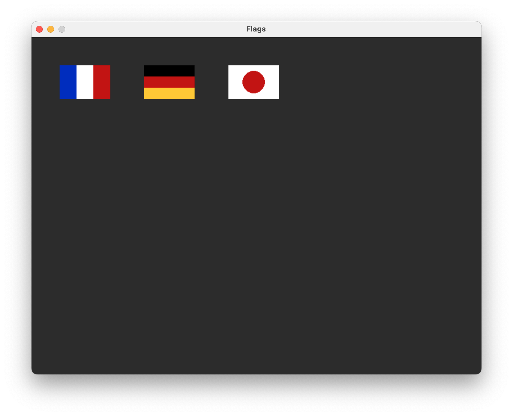
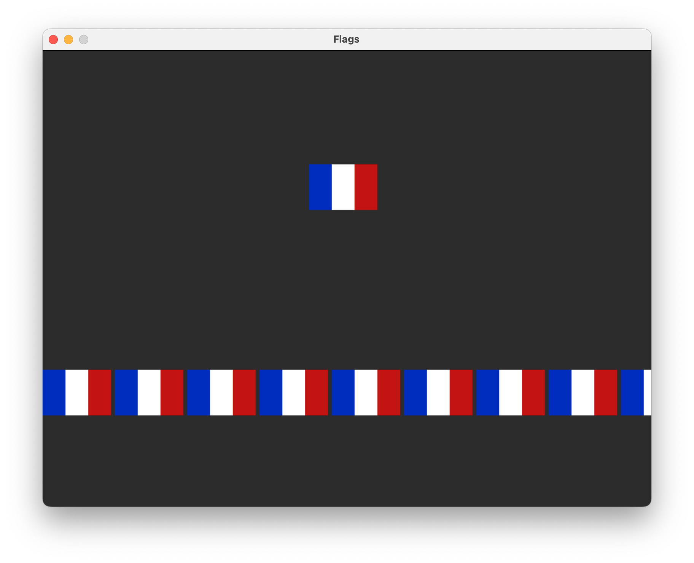
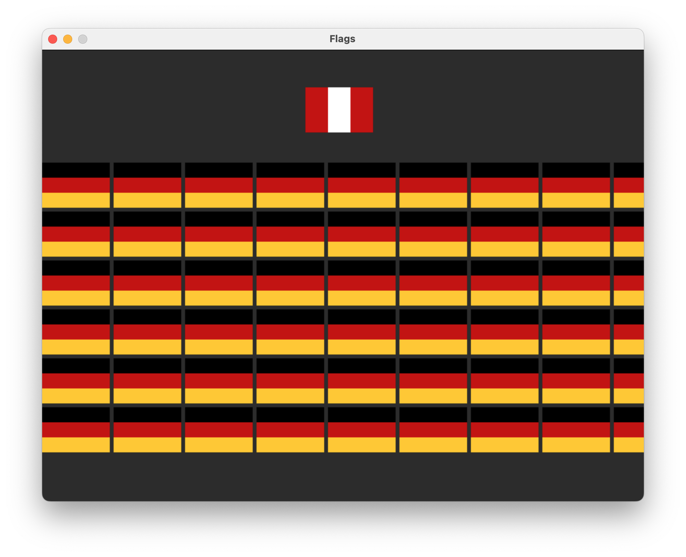
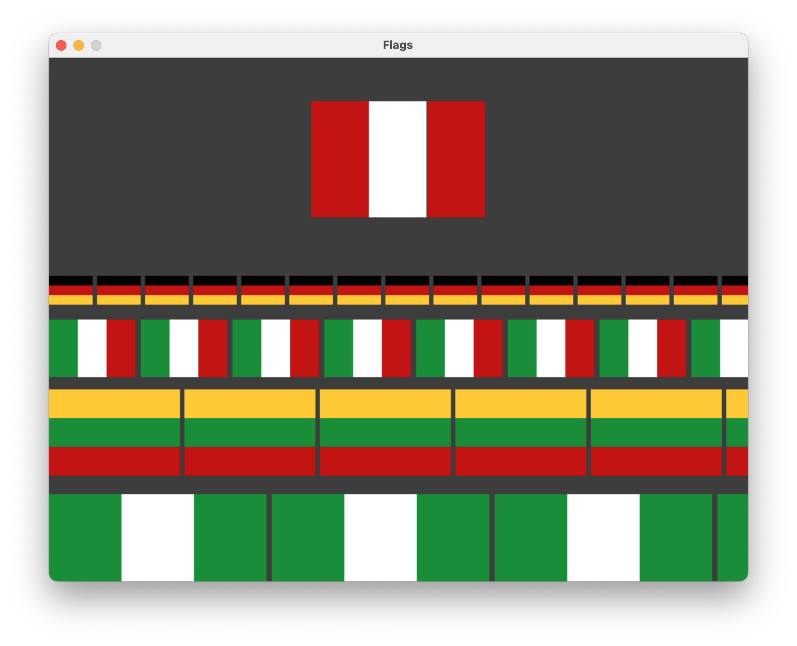

# Functions to Draw Graphics - Examples
Here are examples of Pygame graphics at the different achievement levels. Study these examples to get hints for your own creations.

## Definitions
**Composite Object**: A single graphic element made up of several different shapes such as lines, rectangles, etc.

**Function**: A block of organized, reusable code that performs a specific task. It groups a set of statements so they can be run more than once in a program.

**Parameter**: A parameter is a variable in a function definition. It's a placeholder for the actual value (known as the *argument*) that will be passed to the function when it's called. Parameters are listed inside the parentheses in the function definition.

**Argument**: An argument is the actual value that is passed to a function when it is called. It corresponds to the parameter defined in the function. Arguments are passed inside the parentheses when calling the function.

**Return Value**: The return value is the value that a function sends back to the caller after it completes its task. It is specified using the `return` statement in the function definition.

**Docstrings**: A specific type of comment that is used to describe Python functions, methods, and modules. Short for *documentation strings*. See more on how to write docstrings [here](https://github.com/STE-Technology/ICS3U-Docstrings).

## Notes on Style
In my examples, note the following examples of proper programming style:
- Function definitions occur the top level of the program, before the `while running:` loop. 
- Functions begin with a [docstring](https://github.com/STE-Technology/ICS3U-Docstrings) comment to clearly define purpose and usage.
- Two line spaces are used *before* and *after* a function definition. This helps clearly define logical paragraphs, i.e., what is part of the function, and what is not.


## Examples
### Level 1
**Criteria**: A function is used to draw a composite object. A composite object is a single drawn object made up of several different shapes such as lines, rectangles, etc.



In this example:

- Functions are defined to draw a composite object. In the example below, three rectangles (`pygame.draw.rect()`) make up the French flag:
```python
def draw_flag_france():
    """
    Draws a French flag with top left corner at (50, 50).

    Parameters:
        none
    """
    pygame.draw.rect(screen, BLUE, (50, 50, 30, 60))
    pygame.draw.rect(screen, WHITE, (80, 50, 30, 60))
    pygame.draw.rect(screen, RED, (110, 50, 30, 60))
```
- Note that colours and position are explicitly declared (or "hard-coded") into the function. Because of this, the `draw_flag_france()` function is only good for drawing one flag at one specific position. It cannot be reused.
- See the complete Level 1 example in the included file [`example_level1.py`](example_level1.py).

<br><br>

### Level 2
**Criteria**: A function is defined with *parameters* to draw a composite object at different locations specified by the function parameters. 



In this example:
- The function from Level 1 is modified to use parameters for (x, y) position.
```python
def draw_flag_france(x_origin, y_origin):
    """
    Draws a French flag of 90x60 dimensions.

    Parameters:
        x_origin (int): x-value coordinate of top left corner of the flag.
        y_origin (int): y-value coordinate of top left corner of the flag.
    """
    pygame.draw.rect(screen, BLUE, (x_origin, y_origin, 30, 60))
    pygame.draw.rect(screen, WHITE, (x_origin + 30, y_origin, 30, 60))
    pygame.draw.rect(screen, RED, (x_origin + 60, y_origin, 30, 60))
```
- Docstrings describe how to use the parameters and the expected data type (int).
- Because the position parameter can change, we can reuse the function multiple times to draw the French flag at different (x, y) coordinates.
- A loop is used to call the function with different arguments, drawing a row of flags.
- The size of the flag, 90 px by 60 px, is still hard-coded in the function. 
- See the complete Level 2 example in the included file [`example_level2.py`](example_level2.py).

<br><br>

### Level 3
**Criteria**: Level 2 specifications, plus:
- At least one more function with parameters to draw another composite object at various locations locations specified by the parameters.
- Include additional parameters to modify the object(s) drawn, e.g., colour, size, etc.


In this example:
- We build on the flag drawing function with even more parameters.
- In addition to (x, y) position, we also accept parameter values for (r, g, b) colours.
```python
def draw_flag_vertical(x_origin, y_origin, colour1=RED, colour2=WHITE, colour3=RED):
    """
    Draws a three-stripe vertical flag of 90x60 dimensions.

    Parameters:
        x_origin (int): x-value coordinate of top left corner of the flag.
        y_origin (int): y-value coordinate of top left corner of the flag.
        colour1 (tuple, optional): RGB colour of the first bar. Default is RED.
        colour2 (tuple, optional): RGB colour of the second bar. Default is WHITE.
        colour3 (tuple, optional): RGB colour of the third bar. Default is RED.
    """
    pygame.draw.rect(screen, colour1, (x_origin, y_origin, 30, 60))
    pygame.draw.rect(screen, colour2, (x_origin + 30, y_origin, 30, 60))
    pygame.draw.rect(screen, colour3, (x_origin + 60, y_origin, 30, 60))
```
- Default values are written for the optional colour parameters. 
- NOTE: A *tuple* is the name of data structure that is similar to lists, but written using parentheses `()` rather than square brackets `[]`. In Pygame, we've been using tuples for things like RGB colour `(255, 255, 255)` and coordinates `(50, 50)`.
- Several functions are declared to draw different composite objects. 
- On L79, we call `draw_flag_vertical(350, 50)` with no arguments for colour. Thus, the default red/white/red colours are used to draw a vertical flag at (350, 50).
- On L84, we call `draw_flag_horizontal(x, y, BLACK, RED, GOLD)` passing both (x, y) values from the nested loops, and specific colours to create the German flag.
- See the complete Level 3 example in the included file [`example_level3.py`](example_level3.py).


<br><br>

### Level 4
**Criteria**: Level 3 specificiations, plus:
- Demonstration of a function with parameters and a return value.
- Return value can give information about the object drawn, for example, a function that draws a rectangular flag can return the (x, y) coordinates of the centre of the flag.



In this example: 
- A size parameter has been added to both flag drawing functions. The parameter allows the user to specify `width` of the flag. Height is calculated automatically based on a 3:2 aspect ratio.
```python
def draw_flag_vertical(x_origin, y_origin, width, colour1=RED, colour2=WHITE, colour3=RED):
    """
    Draws a three-stripe vertical flag.

    Parameters:
        x_origin (int): x-value coordinate of top left corner of the flag.
        y_origin (int): y-value coordinate of top left corner of the flag.
        width (int): Width of flag in pixels.
        colour1 (tuple, optional): RGB colour of the first bar. Default is RED.
        colour2 (tuple, optional): RGB colour of the second bar. Default is WHITE.
        colour3 (tuple, optional): RGB colour of the third bar. Default is RED.

    Returns:
        height (int): Height of the flag in pixels.
    """
    height = width / 1.5

    pygame.draw.rect(screen, colour1, (x_origin, y_origin, width / 3, height))
    pygame.draw.rect(screen, colour2, (x_origin + width / 3, y_origin, width / 3, height))
    pygame.draw.rect(screen, colour3, (x_origin + 2 * width / 3, y_origin, width / 3, height))
    
    return height
```
- The example shows how the size and colour parameter can be used to get many different varieties of designs from a single function definition.
- The function also has a return value, `height`, a calculated integer value describing the height of the generated flag based on the value of `width`.
- See the complete Level 4 example in the included file [`example_level4.py`](example_level4.py).

#### About Return Values
In the example, the return value isn't actively used to draw anything. It isn't a requirement for this assignment to have your return values be used in the actual designs. They simply need to exist, and to be useful for something.

L105 and L107 show a output statement helpful for debugging. This print statement  puts the height and position of the flag to the terminal or console. This might be useful for someone trying to figure out the placement of various shapes. 

```python
flag_height = draw_flag_horizontal(x, 250, 50, BLACK, RED, GOLD)

print(f"Drawing 50w x {flag_height}h at x={x}, y=250")
```

This will result in something like this in the terminal:

```
Drawing 50w x 33.333333333333336h at x=110, y=250
Drawing 50w x 33.333333333333336h at x=165, y=250
Drawing 50w x 33.333333333333336h at x=220, y=250
```

You could conceivably write the program in such a way that the height of the previous row (returned by the function) is then used to set the position of a new row.